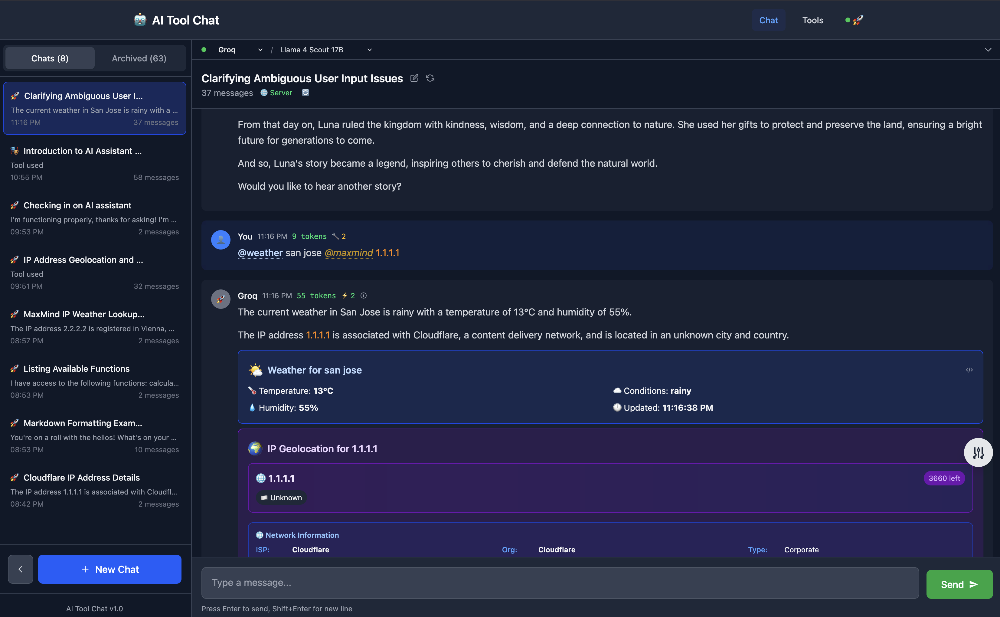
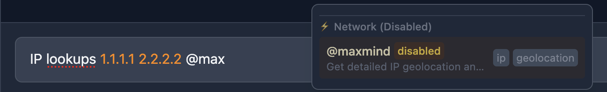
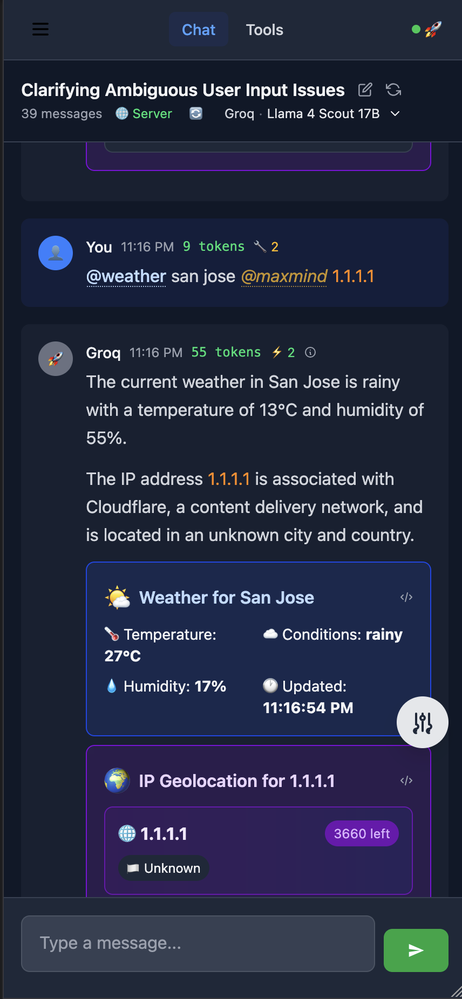
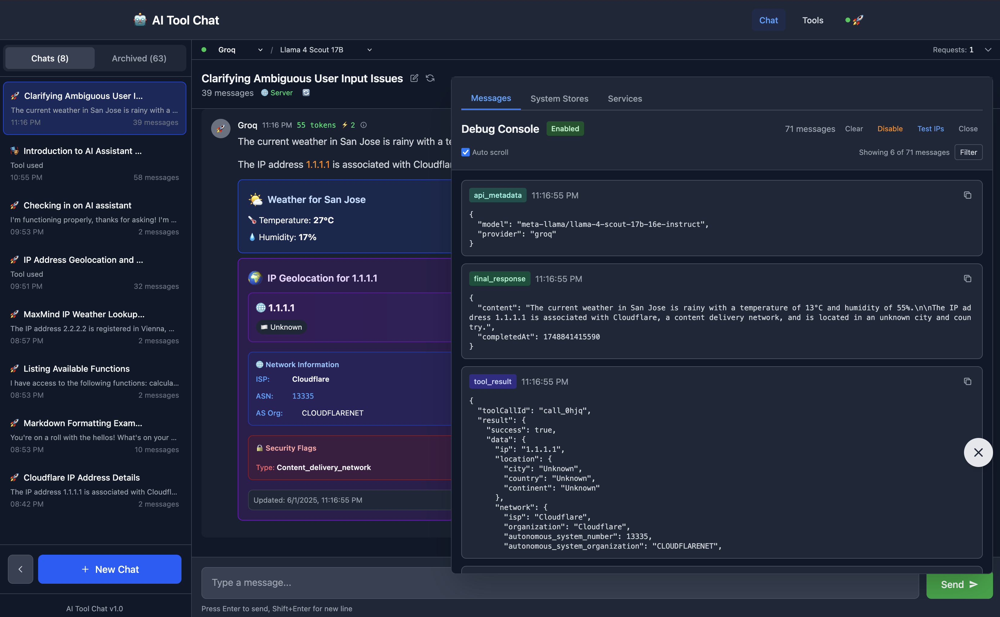
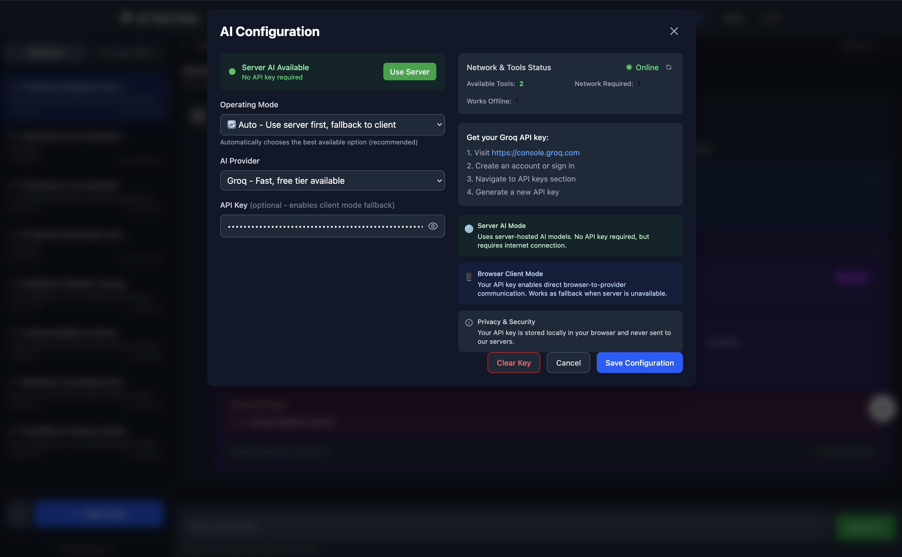
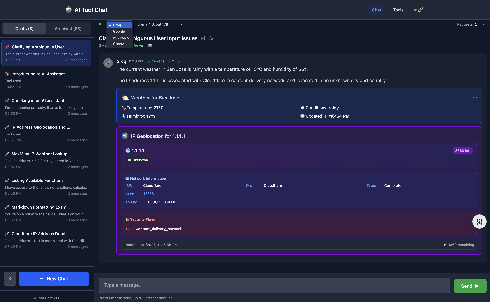
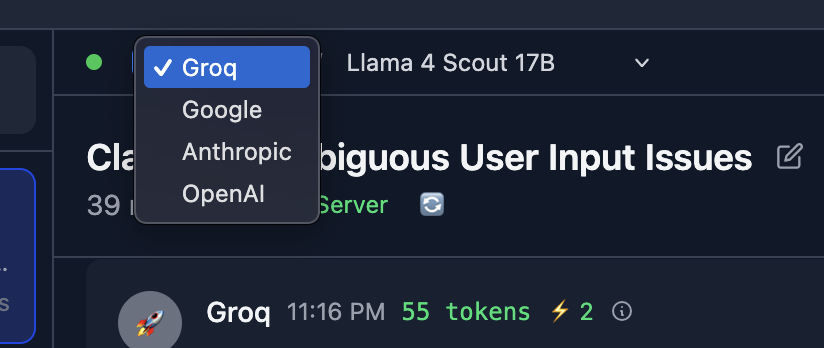
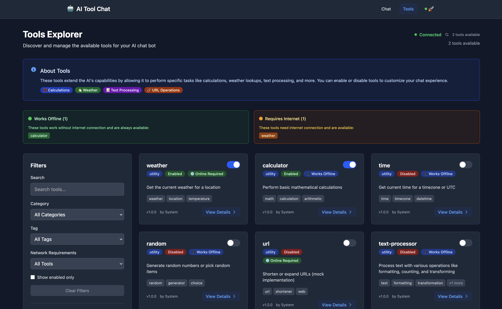
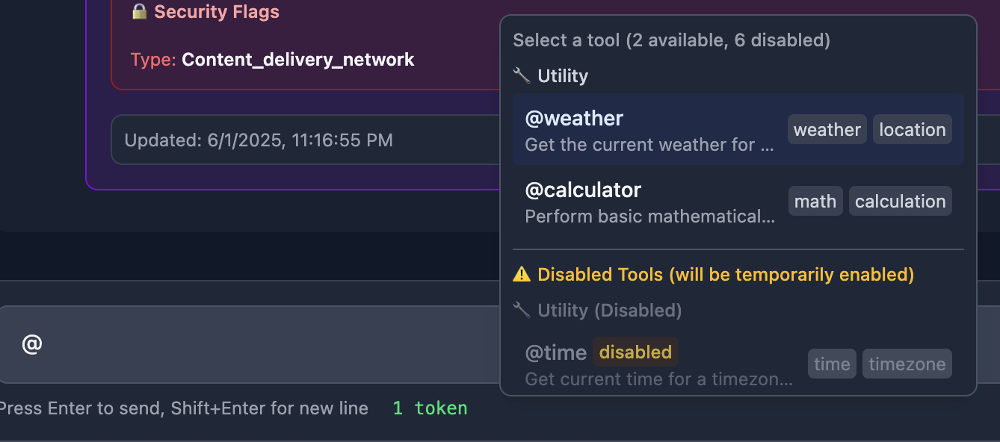

# User Interface Overview

This document provides a visual tour of the AI Tool Chat interface, showcasing its key features and components.

## Main Chat Interface

The main chat interface features:
- Clean, modern design with a sidebar for chat management
- Real-time message streaming
- Rich markdown rendering with syntax highlighting
- Responsive layout that works on both desktop and mobile

## Dark Mode Support

The application automatically detects your system's dark/light mode preference and adapts accordingly:
- Dark theme with comfortable contrast ratios
- Maintains visual hierarchy and readability
- Consistent styling across all components

## Chat Sidebar

The sidebar provides comprehensive chat management:
- **New Chat**: Start fresh conversations
- **Active Chats**: Quick access to ongoing conversations
- **Archived Tab**: Access to archived chat history
- **Chat Actions**: Rename, archive, or delete chats
- **Visual Indicators**: Recent activity and chat status

## Tool Selection System

### Tool Selector Popup

The @ shortcut opens a powerful tool selector:
- **Category Organization**: Tools grouped by function
- **Visual Icons**: Easy identification of tool types
- **Descriptions**: Clear explanations of each tool's purpose
- **Keyboard Navigation**: Arrow keys and shortcuts supported

### Real-time Tool Filtering

Smart filtering as you type:
- **Instant Results**: Filters by name, description, category, or tags
- **Highlighted Matches**: Visual feedback for search terms
- **Keyboard Shortcuts**: Tab for quick selection, Escape to close
- **Context-aware**: Only shows relevant, enabled tools

## Tool Examples in Action

### Weather Tool

The weather tool provides comprehensive weather information:
- Current conditions and temperature
- Weather descriptions and forecasts
- Location-specific data
- Rich formatting with icons and structured data

### Calculator Tool

The calculator tool handles mathematical operations:
- Support for complex expressions
- Step-by-step calculation display
- Accurate numerical results
- Integration with natural language queries

## Text Formatting Features

Advanced text formatting capabilities:
- **Tool Mentions**: `@toolname` highlighted with blue badges
- **URL Detection**: Automatic highlighting of web links
- **Real-time Formatting**: Updates as you type
- **Visual Feedback**: Clear distinction between formatted and plain text

## Tools Interface Page

Dedicated tools exploration interface:
- **Tool Discovery**: Browse all available tools
- **Interactive Testing**: Try tools without starting a chat
- **Documentation**: Access detailed tool descriptions
- **Category Filtering**: Organize tools by type and function

## Archive Management

Comprehensive chat history management:
- **Archive System**: Move old chats out of active view
- **Restore Functionality**: Bring archived chats back to active
- **Permanent Deletion**: Remove chats you no longer need
- **Visual Organization**: Clear separation between active and archived

## Key UI Features

### Responsive Design
- Works seamlessly on desktop, tablet, and mobile devices
- Adaptive layouts that scale to different screen sizes
- Touch-friendly interactions on mobile devices

### Accessibility
- High contrast ratios for readability
- Keyboard navigation support throughout
- Screen reader compatible markup
- Focus indicators for interactive elements

### Performance
- Real-time streaming with smooth animations
- Efficient rendering of large chat histories
- Optimized image and asset loading
- Local storage for instant chat access

### Theme Consistency
- Unified design language across all components
- Consistent spacing and typography
- Harmonious color palette in both light and dark modes
- Professional appearance suitable for various use cases

The interface is designed to be intuitive while providing powerful functionality, making it easy for users to harness the full potential of AI-powered tool integration.